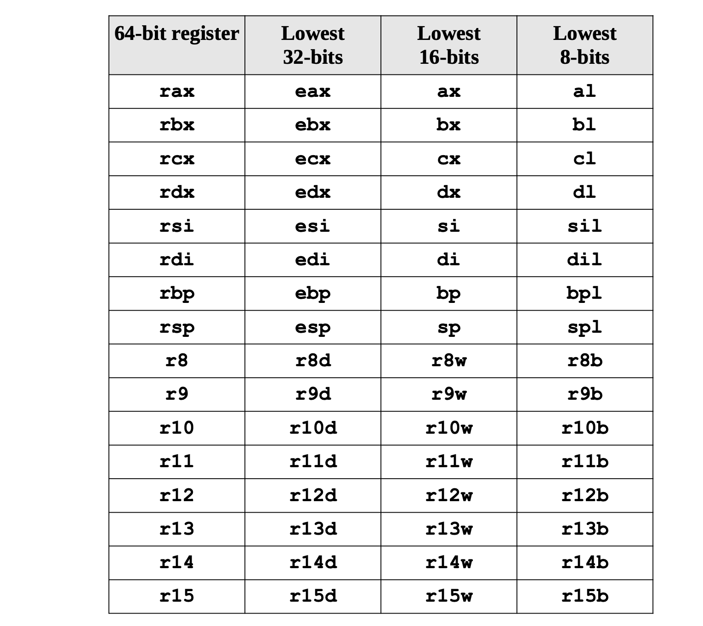
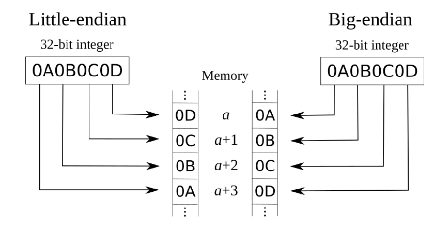

# x86_64 assembly 


## CPU Architecture

### Operating Modes:

These determine the assumed/default size of instruction operands
and restrict which opcodes are available, and how they are used.

Modern operating systems, booted inside `Real` mode,
must escalate first to `Protected` mode, and then `Long` mode,
as support and capability is detected. This is done to remain backward-compatible.

This means modern applications run exclusively in `Long` 64-bit mode.

Mode|Default Operand Size|Default Address Size|Description
-|-|-|-
[`Long`](https://en.wikipedia.org/wiki/Long_mode) | `32`-bit | `64`-bit | Latest.
[`Protected`](https://en.wikipedia.org/wiki/Protected_mode) | `32`-bit | `32`-bit | Legacy. Introduced segment registers (protected virtual addresses).
[`Real`](https://en.wikipedia.org/wiki/Real_mode) | `16`-bit | `16`-bit | Legacy. Unlimited direct access to addressable memory. Compatible with oldest x86 CPUs.

There are also modes called [`Virtual 8086`](https://en.wikipedia.org/wiki/Virtual_8086_mode) and [`Long Compatbility`](https://en.wikipedia.org/wiki/IAMD64#Operating_modes) which are middle steps that emulate the previous mode. They are meant for backward compatibility and are provide fast context-switching for multi-tasking. (ie. So you can run 32-bit applications in a 64-bit operating system.)

### Registers

Register|Name|Commonly
-|-|-
`A`|**Accumulator**|Return value, especially the sum of arithmetic operations.
`B`|**Base index**|Starting point of an array or list structure.
`C`|**Counter**|Used by loops ie. the `i` in `for(int i=0; i<9; i++)`
`D`|**Data**|Extended space for accumulator.<br>(ie. `32`-bit mode will combine `EAX+EDX` to work on `64`-bit values)
`BP`|**Base Pointer**|Pointer to address of current stack frame.<br>(where function parameters end, and local variables begin)
`SP`|**Stack Pointer**|Pointer to address of last bytes `PUSH`ed to memory.
`SI`|**Source Index**|Starting point of unbounded stream data, especially a string.
`DI`|**Destination Index**|Ending point of unbounded data, especially in slicing operations.

### Instruction Encoding and Decoding
 0-4 bytes   | 1-3 bytes   | 0-1 byte      | 0-1 byte                 | 0,1,2,4 bytes     | 0,1,2,4,8 bytes |
-------------|-------------|---------------|--------------------------|-------------------|-----------------|
 `Prefix`    | `Opcode`    | `Mod-Reg R/M` | `Scale-Index-Base (SIB)` | `Displacement`    | `Immediate`     |

### Addressing Modes
Operands for a CPU instruction can be in a **Register**,**Memory** or **Immediate** (hardcoded in the insruction itself)
* **Immediate Addressing** - we hard code a value in the instruction itself either as an immediate value or as a displacement in SIB mode
* **Register Addressing** - accessing contents of a register, it's very straightforward 
* **Register Indirect Addressing** - effective address of the data is stored in a register and then the data is accessed by dereferencing the effective address  
* **Scale, Index, Base, Displacement Addressing** - we can use a combination of scale, index, base, and displacement to compute an address and then fetch data from that address
  - [base] + [index × scale] + disp32
  - disp(base, index, scale) - AT & T Syntax
* **Implied Addressing** - some instructions will assume the operand without explicitly mentioning them in the instruction, _inc and dec_ will assume to add one or decrease by one

### Endianess
* **Little Endian** - LSB is stored at lowest address  
* **Big Endian** - MSB is stored at lowest address



### CPU Architecture
* **CISC** - Complex Instruction Set Computation
* **RISC** - Reduced Instruction Set Computation

### CPU Memory Architecture
* **Load Store** - For an instruction , both of the operands must be in the register. We use separate instruction for loading the data from memory to register and register to memory to save the computation
* **Register Memory** - For an instruction , one operand can be in memory and other operand can be in register 

### One's complement , Signed , Unsigned
* We cannot represent negative numbers using '-' sign infront of a number as we do it in paper. so we have to instruct the computer that a number is negative or positive.
* So we represent negative numbers using One's complement notation

### Instruction Set
* Data Movement Instructions
* Arithmetic Instructions
* Control Instructions
* Conversion Instructions - resize the data ( shrink or stretch ) 
* Logical Instructions

## GAS Assembly

### Structure of an assembly program
* Data section - initialized variables and constants
* Bss section -  uninitialized variables
* Text section - contains assembly instructions

### Operand Size Suffixes of GAS Assembly
* b = byte (8 bit).
* s = single (32-bit floating-point).
* w = word (16 bit).
* l = long (32-bit integer or 64-bit floating-point).
* q = quad (64 bit).
* t = ten bytes (80-bit floating point).

### Instruction Syntax

| Mnemonic  | Source | Destination |   
| ------------- | ------------- | ----------- |

**Opcode/Mnemonic** - Operation code like ```mov,add,sub```  
**Source** - Immediate / Register   
**Destination** - Register   

### Prefixes
* When referencing a register, the register needs to be prefixed with a "%".
* Constant numbers need to be prefixed with a "$".

### Calling Conventions
* calling convention specifies registers which should be preserved by caller and callee.
* It also specifies which registers should be used for passing parameters and return values.
* **Callee saved registers** - RBX, RSP, RBP, R12, R13 , R14 , R15
* **Arguments passing** RDI, RSI, RDX, RCX, R8, R9 
* **Return Value** Integer return values up to 64 bits in size are stored in **RAX** while values up to 128 bit are stored in **RAX** and **RDX**. Floating-point return values are similarly stored in **XMM0** and **XMM1**.

## Things to understand
* how **conditional statements** are converted to assembly
* how **loops are converted** to assembly
* how **structures** are converted to assembly  
* how **pointers** are converted to assembly
* how **arrays** are converted to assembly
* how **unions** are converted to assembly
* how **logical operators** are converted to assembly
* how **post/pre increment/decrement** operators are converted to assembly

## Instruction Set
### Instructions for comparing
 
|Instr   | Description                  | signed-ness | Flags              |  
|--------|------------------------------|-------------|--------------------|  
| JO     | Jump if overflow             |             | OF = 1             |
| JNO    | Jump if not overflow         |             | OF = 0             |
| JS     | Jump if sign                 |             | SF = 1             |
| JNS    | Jump if not sign             |             | SF = 0             |
| JE/    | Jump if equal                |             | ZF = 1             |
| JZ     | Jump if zero                 |             |                    |
| JNE/   | Jump if not equal            |             | ZF = 0             |
| JNZ    | Jump if not zero             |             |                    |
| JP/    | Jump if parity               |             | PF = 1             |
| JPE    | Jump if parity even          |             |                    |
| JNP/   | Jump if no parity            |             | PF = 0             |
| JPO    | Jump if parity odd           |             |                    |
| JCXZ/  | Jump if CX is zero           |             | CX = 0             |
| JECXZ  | Jump if ECX is zero          |             | ECX = 0            |

Then the unsigned ones:


|Instr   | Description                  | signed-ness | Flags              |
|--------|------------------------------|-------------|--------------------|
| JB/    | Jump if below                | unsigned    | CF = 1             |
| JNAE/  | Jump if not above or equal   |             |                    |
| JC     | Jump if carry                |             |                    |
| JNB/   | Jump if not below            | unsigned    | CF = 0             |
| JAE/   | Jump if above or equal       |             |                    |
| JNC    | Jump if not carry            |             |                    |
| JBE/   | Jump if below or equal       | unsigned    | CF = 1 or ZF = 1   |
| JNA    | Jump if not above            |             |                    |
| JA/    | Jump if above                | unsigned    | CF = 0 and ZF = 0  |
| JNBE   | Jump if not below or equal   |             |                    |

And, finally, the signed ones:


|Instr   | Description                  | signed-ness | Flags              |
|--------|------------------------------|-------------|--------------------|
| JL/    | Jump if less                 | signed      | SF <> OF           |
| JNGE   | Jump if not greater or equal |             |                    |
| JGE/   | Jump if greater or equal     | signed      | SF = OF            |
| JNL    | Jump if not less             |             |                    |
| JLE/   | Jump if less or equal        | signed      | ZF = 1 or SF <> OF |
| JNG    | Jump if not greater          |             |                    |
| JG/    | Jump if greater              | signed      | ZF = 0 and SF = OF |
| JNLE   | Jump if not less or equal    |             |                    |


### Does pointer points to LSB or MSB of a data object? 

* Let's take an integer of four bytes **0x0A0B0C0D**. 
* Depending on whether the CPU architecture is **Little Endian** or **Big Endian** the order of the bytes stored can change.
* But irrespective of the whether the machine is **Little Endian** or **Big Endian** we have to figure out whether the pointer points to the LSB or MSG.
* So there are four possibilities. 
  * Little Endian - but pointer points to MSB
  * Big Endian - but pointer points to LSB 
  * Little Endian - pointer points to LSB 
  * Big Endian - pointer points to MSB
* pointer always points to lower memory address? we have to figure it out
  * Atleast in c , it seems pointer points to the Lowest address irrespective of whether the machine is Little Endian or Big Endian.
